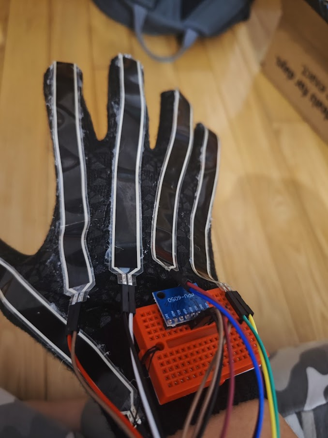

# APCSA Blog Entry 3

# Blog Entry 3

February 2nd, 2023

---

### Content

For the past couple months, I’ve been working with TensorFlow. Working with a dataset that I generated by myself and a dataset I found on the internet for the hand signs. The current idea is to get it to recognize the basic alphabet. This was done by holding down a sign for a while, but I don’t wanna train it for all the words. This is why I will be using pattern recognition to translate gloves’ data to [images](https://www.kaggle.com/datasets/signnteam/asl-sign-language-pictures-minus-j-z), then the images to words. It will take the result that the model is most confident with, and then print it.

### Creating Prototype 1

The first prototype used flex sensors that were crudely hot-glued to a cheap pair of gloves (that admittedly worked pretty well). The flex sensors were wired to an Arduino using a breadboard, which was sewn to the glove. By adding accelerometer data, it allows me to gather data about how the hand is moving, in what direction and where it is at. Ideally, the method for tracking the position of the hand would be done by using a LiDAR or a camera. The gyroscope is used to determine the orientation, or rather how the glove is rotating relative to it’s current orientation. 

### Engineering Design Process

I am finished with the prototyping process and the testing process. The next steps are to improve as needed, and repeat the testing process. I plan on improving it by making the readings much more accurate. Flex sensors have way too much noise to make it viable for accurate readings. That’s why I am switching to potentiometers. Potentiometers offer way less noise and more accurate readings.

### Skills

The skills that I’ve used are How to Google, How to Learn, and Problem Decomposition.

[Previous](entry02.md) | [Next](entry04.md)

[Home](../README.md)
